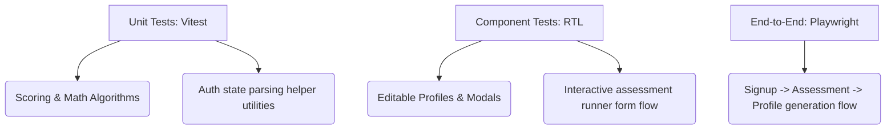

# ElevateU Technical Codebase & Product Audit
**Prepared by:** Senior/Staff Frontend Engineer & Product Reviewer  
**Date:** July 2026  
**Project:** ElevateU (Vite + React + Tailwind CSS Web Application)

---

## 1. CODE ARCHITECTURE & QUALITY

### Component Reuse and Consistency
- **Standardized UI Component Drift:** The project defines generic UI primitives under `src/components/ui/` (`Button.jsx`, `Input.jsx`, `Card.jsx`, `Badge.jsx`). While these are leveraged across core sections, there is styling drift and use of raw HTML elements:
  - `src/pages/CoursesAndJobs.jsx` uses native `<input>` tags for course search and location filters rather than the `<Input>` component, leading to mismatched border and focus states.
  - `src/pages/SkillGapAnalysis.jsx` (line 346) and `src/pages/CareerDetail.jsx` (line 51) render raw `<button>` elements with inline Tailwind padding and background utilities instead of the `<Button>` component.
  - Native checkboxes are used for checklist items in `src/pages/LearningRoadmap.jsx` (line 269), which could be abstracted into a unified `Checkbox` UI component to maintain visual consistency.
- **Visual Token Enforcement:** The palette is heavily reliant on Tailwind CSS variables defined in `index.css`. The components generally respect the dark/light variables, but inline overrides such as hardcoded opacity (e.g. `bg-[#1E293B]` and border classes) exist, bypassing theme variables.

### Folder Structure and Naming
- The directory layout is highly structured and consistent:
  - `src/components/` is divided logically into feature blocks (`home/`, `profile/`, `chatbot/`, `marketing/`) and layout wrapper blocks (`layout/`).
  - `src/pages/` separates major routing destinations from `/marketing` pages.
  - `src/services/` isolates data fetching.
- **Naming Conventions:** JavaScript files are correctly named in camelCase for services/utils (`resumeService.js`) and PascalCase for React components (`MarketingPageLayout.jsx`).

### Dead Code and Duplication
- **Social Icon Duplication:** `Footer.jsx` uses `@icons-pack/react-simple-icons`, but `react-icons` was also introduced, creating potential package bloat and import overlap.
- **Unused Core Packages:** `lucide-react` is used extensively for UI layout icons alongside `react-icons` (which wraps font-awesome/brand icons). This imports redundant svg-generation runtimes.

### State Management & Context Manageability
- Currently, the app defines two contexts: `AuthContext.jsx` and `ThemeContext.jsx`.
- At the current project scale, this provider chain is manageable. However, as features expand (e.g., tracking multi-step assessments, course progress, chatbot logs), sharing state via nested Contexts will trigger global tree re-renders. A lightweight store like **Zustand** or **Redux Toolkit** should be introduced for complex features like `LearningRoadmap` and `AssessmentRunner` to isolate re-renders.

### TypeScript Suitability Assessment
- **Honest Review:** At the current scale (~4,500 LOC, 25 views), TypeScript is **not strictly mandatory but highly recommended**. 
  - *Why?* The data structures returned by the mock services (e.g., complex nested JSON for `roadmapService.js` and `assessmentService.js`) are complex and prone to runtime typing mismatches when wired up to a real database. 
  - Introducing TypeScript would document contract structures (like `User`, `Assessment`, `Course`, `JobOpportunity`) and save hours of debugging during backend integration.

### Route-Level Error Boundaries
- **Severe Gap:** There are **zero React Error Boundaries** around route-level components in `AppRoutes.jsx` or `App.jsx`. A rendering crash anywhere inside a page layout (e.g. a chart drawing error, missing mock key reference) results in a total blank white screen, disrupting the user experience.

---

## 2. PERFORMANCE

### Bundle Size & Heavy Dependencies
- **Recharts Impact:** `recharts` is a heavy SVG rendering library that depends on `lodash` components and `d3` modules. It is imported statically at the top of `Dashboard.jsx` and `SkillGapAnalysis.jsx`.
- **Icon Libraries:** Using both `lucide-react` and `react-icons` increases chunk weight if tree-shaking fails. Vite's production bundler (Rolldown/Esbuild) mitigates this, but importing entire barrel layouts of libraries should be audited.

### Code-Splitting Strategy
- **Severe Gap:** Every single view (including all 12 static marketing pages, the chatbot widget, dashboard charts, and profile modals) is loaded in the **initial main bundle**. 
- **Action Required:** `AppRoutes.jsx` must implement `React.lazy()` and `<Suspense>` for routing. Public marketing pages (e.g., `/terms`, `/privacy`, `/about`) should not block the user loading `/login` or the `/dashboard`.

### Image Loading Strategy
- **Mockup Optimization:** The application does not use external banner images—even the browser dashboard mockup in `HeroSection.jsx` is coded entirely in HTML/CSS. This keeps media asset payload low.
- **Logo Optimization:** The single `logo.png` image is loaded via static ES import. There is no lazy-loading (`loading="lazy"`) configuration on below-the-fold icons or logo elements.

### Re-renders & Memoization Gaps
- **Recharts Re-rendering:** In `Dashboard.jsx` and `SkillGapAnalysis.jsx`, charting data and layout definitions (like grid, tooltip colors, and hooks) are calculated on every render. Because the chart depends on color constants from `useChartColors()` which is re-instantiated, the Recharts engine triggers expensive SVG recalculations on theme toggles or window resizing.
- **Missing `useMemo`:** Calculations in `CoursesAndJobs.jsx` that filter lists of jobs and courses based on search terms should be wrapped in `useMemo` to avoid re-filtering lists on every keystroke.

### Font Loading Strategy
- **Critical Blocking Asset:** In `index.css`, fonts are loaded using `@import url('https://fonts.googleapis.com/css2?family=Inter...');`. 
- **Performance Impact:** CSS `@import` blocks the rendering pipeline. The browser cannot render the page layout until it parses `index.css`, triggers the network request for Google Fonts, and downloads the typography assets, causing a Flash of Unstyled Text (FOUT).

---

## 3. UX & PRODUCT GAPS

| Gap Area | Status | Review & Recommendation |
| :--- | :--- | :--- |
| **User Onboarding** | 🔴 Missing | A newly signed-up user is dropped directly onto the Dashboard. There is no guided walkthrough, placeholder initialization, or tooltip sequence explaining how to start an assessment or configure a profile. |
| **Notifications** | 🔴 Missing | No notifications system exists. Competing platforms (Coursera, LinkedIn Learning) use push notifications or alert bells to prompt users about roadmap deadlines, course updates, or profile views. |
| **Search Functionality** | 🟡 Partial | There is basic search functionality implemented inside `CoursesAndJobs.jsx`. However, there is no global header search to find skills, roadmaps, or help documents from any dashboard page. |
| **404 Fallback page** | 🟡 Partial | Unmatched paths redirect directly to `/` instead of showing a user-friendly 404 page. This is disorienting for users who input incorrect URLs. |
| **Data Persistence** | 🟡 Mocked | All edited profile fields, completed assessments, and resume scores reset upon browser reload because states are stored in volatile React memory. |
| **Form Validation** | 🟡 Basic | `Login.jsx` and `Signup.jsx` check for blank inputs and basic email formats. However, password strength checks (requiring symbols, numbers, and case variation) are absent. |
| **Loading/Error States** | 🟢 Good | Clean skeletal loading animations are implemented for profiles, dash states, and resume analyzer screens, providing consistent feedback. |

### Data Persistence Migration Requirements (For Backend integration):
- Introduce token-based session verification (`httpOnly` secure cookies).
- Add synchronization middleware (e.g., Axios interceptors) to save profile changes to `/api/profile` on modal submit.
- Persist draft assessment states in browser `sessionStorage` to prevent losing progress if a student refreshes during an exam.

---

## 4. ACCESSIBILITY (a11y)

### Semantic HTML & Landmarks
- The document structure generally uses modern markup (`<nav>`, `<main>`, `<footer font-bold>`, `<section>`). 
- However, inside the views, semantic hierarchy is broken:
  - Form controls (like search boxes and inputs) lack explicit `<label>` tags, relying solely on placeholder text which screen readers cannot interpret.
  - Testimonial navigation controls (`left`/`right` buttons) are non-interactive `<div onClick>` structures rather than actual `<button>` controls, making them inaccessible to keyboard users.

### Color Contrast Check
- Under **Light Theme**, the secondary text (`#64748B` on `#FFFFFF` page background) yields a contrast ratio of **3.97:1**, which fails the WCAG 2.1 AA requirement of **4.5:1** for normal text.
- Under **Dark Theme**, the secondary text (`#94A3B8` on `#1E293B` card backgrounds) is roughly **3.8:1**, also failing AA guidelines.

### Focus Management on Router Actions
- **Focus Trap:** When routing using `react-router-dom`, focus does not reset. If a user clicks a sidebar element, the focus remains stuck on the sidebar, forcing keyboard users to step through all menu items to reach the main page content. A custom layout component or `useLocation` hook must force focus to the top `<h1>` page heading on render.

### Skip-To-Content Link
- **Missing:** There is no "Skip to Main Content" button at the top of the body tree. Users navigating exclusively via keyboard (Tabbing) must tab through every link in the Navbar and Sidebar drawer on every page load before reaching dashboard content.

---

## 5. SEO & METADATA

- **Static Head Details:** Title and meta descriptions are hardcoded in `index.html`. Every route across the site outputs identical head tags.
  - *Recommendation:* Install `react-helmet-async` or utilize a global React utility to dynamically load SEO tags (e.g., `About ElevateU | Career Guidance` or `Terms of Service | ElevateU`).
- **Open Graph (OG) Tags:** Absent. Public-facing paths (such as the blog posts and landing pages) lack social tags (`og:title`, `og:image`, `og:description`), so sharing a link on LinkedIn or WhatsApp yields a generic, cardless link.
- **Crawler Configurations:** There is no sitemap generator (`sitemap.xml`) or crawler policy (`robots.txt`) in the `/public` root directory, blocking search engines from indexing public routes.

---

## 6. SECURITY READINESS

### Auth Storage Tradeoffs
- Current storage: React state variable `useState(null)`.
- *Production migration roadmap:*
  - **httpOnly Cookies (Recommended):** Store JWT access/refresh tokens in secure, sameSite cookies. This shields the application from XSS-based token theft.
  - **localStorage/sessionStorage:** Avoid placing authentication credentials here, as any injected third-party tracker or compromised npm dependency can execute scripts (`document.cookie` / `localStorage.getItem`) to compromise accounts.

### Cross-Site Scripting (XSS) Analysis
- React's default `{variable}` syntax automatically sanitizes output. 
- **File Upload Risks:** `ResumeAnalysis.jsx` accepts file uploads. While the frontend screens by extension, a real backend requires mime-type checking, virus scanning, and isolated S3 bucket upload sanitization.

### Environment Variable Readiness
- API endpoints are hardcoded in services. Before production, a `.env.example` template must be created:
  ```env
  VITE_API_URL=https://api.elevateu.in/v1
  VITE_GOOGLE_CLIENT_ID=your-google-oauth-client-id
  ```
- Services must read endpoints dynamically: `const BASE_URL = import.meta.env.VITE_API_URL`.

---

## 7. TESTING

Currently, **no automated testing frameworks are configured** (0% test coverage). 
To deploy this platform reliably, the following structured test hierarchy is recommended:



### High-Priority Test Matrix
1. **Critical flow E2E (Playwright):** Student signs up, completes a 5-question tech assessment, verifies the dashboard unlocks recommendations, and saves changes to their Profile.
2. **Algorithm validation (Vitest):** Unit testing the skill assessment engine to ensure correct output scores based on answer selections.
3. **Resume Uploader (React Testing Library):** Verifying file-size check block triggers correctly and error banners appear for unauthorized extensions.

---

## 8. ADVANCED FEATURE IDEAS

1. **Admin & Institution Dashboard:**
   A reporting portal for university admins and coding bootcamps to visualize overall cohort statistics (average assessment scores, top career interests, learning speed, and matching job applications).
2. **Exportable PDF Career Reports:**
   A backend-driven PDF builder allowing students to generate a professionally formatted report compile of their AI Resume analysis, skill gaps, and learning roadmap to share with job recruiters or academic counselors.
3. **Deadlines & Calendar Sync:**
   Let users link their roadmap deadlines to external calendar systems (Google Calendar, Outlook) using automatic iCal subscriptions.
4. **Gamification & Daily Streaks:**
   Encourage daily study by adding XP, learning streak counters, achievements, and milestone badges (e.g. "Assessments Ace", "Resume Complete").
5. **Localization (L10n):**
   Provide language translation modules (Hindi, regional Indian languages) for the platform, given the primary target audience is young students in tier 2/3 Indian cities.
6. **Offline PWA Support:**
   Introduce Service Workers to cache assessment states and allow offline access to learning roadmap checklists.

---

## PRIORITIZED ROADMAP

This prioritized table outlines technical debt resolution and feature implementation ranked by development importance:

| Priority | Recommendation | Category | Impact | Effort | One-Line Rationale |
| :---: | :--- | :--- | :--- | :--- | :--- |
| **1** | **Add Route Error Boundaries** | Architecture | **High** | Small | Prevents any rendering crash from rendering a blank white screen. |
| **2** | **Code-Split Routing Framework** | Performance | **High** | Small | Shrinks initial load footprint by lazy-loading backend dashboard views. |
| **3** | **Dynamic Page Title & Metadata** | SEO | **High** | Small | Removes generic tab headings across views, allowing correct browser tracking. |
| **4** | **Unify Input & Button Components** | Quality | **Medium** | Small | Eliminates styling drift and normalizes UI components. |
| **5** | **Fix light/dark text contrast** | Accessibility | **High** | Small | Ensures color themes align with WCAG AA readability criteria. |
| **6** | **Implement LocalStorage session cache** | UX | **High** | Medium | Saves authentication states so refreshing the tab does not log the user out. |
| **7** | **Add standard router focus reset** | Accessibility | **Medium** | Small | Shifts keyboard focus back to top level elements on page transition. |
| **8** | **Deepen Form Validation** | UX | **Medium** | Medium | Secures registration inputs by checking password strength and format. |
| **9** | **Write E2E test scripts** | Testing | **High** | Large | Hardens critical paths (Signup → Exam → Profile → Dashboard). |
| **10**| **Decouple CSS font import** | Performance | **Medium** | Small | Moves fonts to preload header link tags, eliminating render blocking. |
| **11**| **Add sitemap and robots crawler docs** | SEO | **Medium** | Small | Enables search engines to properly index public pages. |
| **12**| **Port codebase to TypeScript** | Quality | **High** | Large | Prevents data structure type bugs during backend integrations. |
| **13**| **Abstract contexts to Zustand** | Architecture | **Medium** | Medium | Prevents nested re-render propagation and scales state isolation. |
